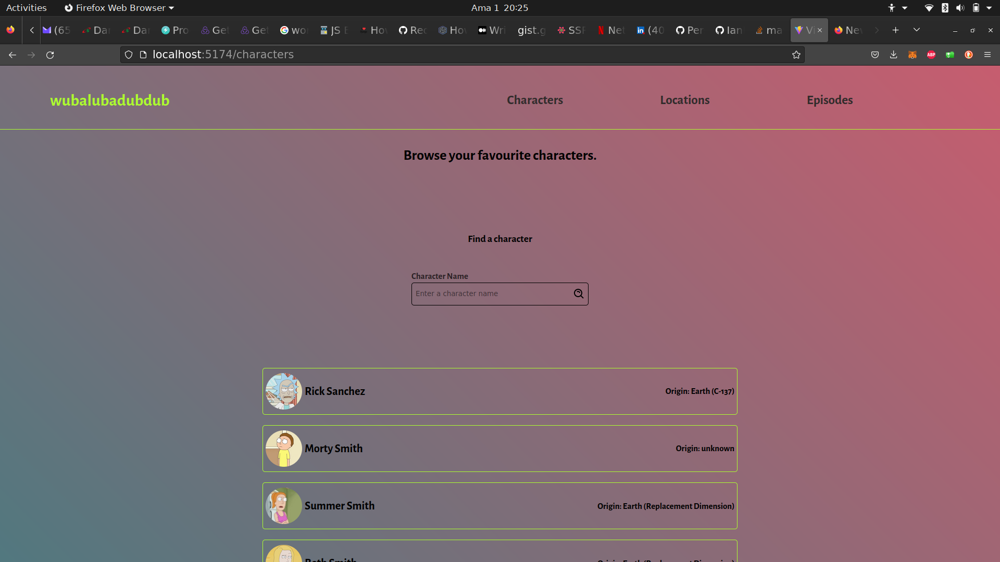

# WUBALUBADUBDUB

## About The App
Wubalubadubdub is an app that you can use to browse characters, epispdes and different locations that exist in the famous adult TV show Rick And Morty. The weird project name is a peculiar catch phrase that Rick Sanchez, the main character occasionally utters in the show.

## Screenshots

## Technologies
I used `React`, `TypeScript`, `Sass`, `Vite`, `ChakraUI`

## Setup
- download or clone the repository
- run `npm install`
- run `npm run dev`

## Status
Wubalubadubdub is still in progress. `Version 2` will be out soon.

